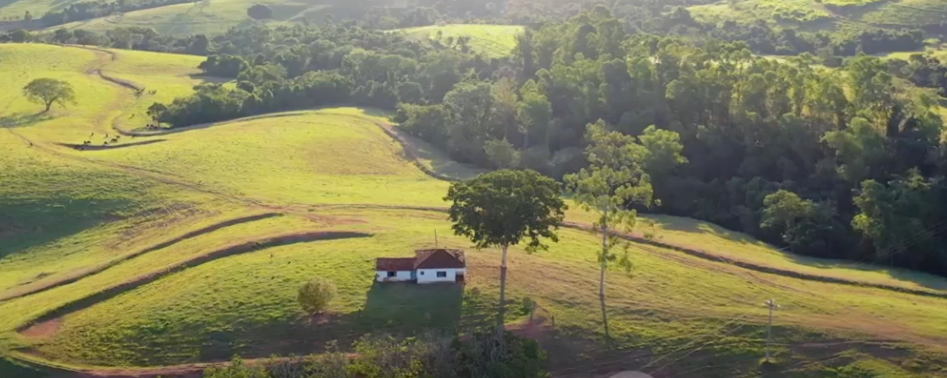

### Natural ou Fake Natty? Como Vencer na Era das IAs Generativas

# ESTE VÍDEO EM NOSSA CIDADE É REAL???

## 📒 Descrição
Criar um video extremamente realista como IA e apresenta-lo para amigos, perguntando se foi gerado por IA ou é um vídeo real

## 🤖 Tecnologias Utilizadas
- [INVIDEO](https://invideo.io/)

## 🧐 Processo de Criação
Através de um prompt no INVIDEO solicitei a criação de um vídeo.

PROMPT: Drone Adventure Over Alto Paraíso de Goiás!

## 🚀 Resultados
Antes de assistir ao vídeo, pedimos aos participantes que tentassem discernir se o vídeo era uma gravação autêntica ou uma criação de IA. Para nossa surpresa, a maioria das pessoas não conseguiu identificar que o vídeo era gerado por IA. Esse resultado destaca a incrível capacidade das ferramentas modernas de IA em produzir conteúdo que é quase indistinguível da realidade.

- [Video Criado](https://ai.invideo.io/watch/4cLUmwao9dC)

    

## 💭 Reflexão 
###O Impacto e as Implicações
Este experimento não apenas sublinhou a evolução da tecnologia de geração de vídeos, mas também levantou questões importantes sobre a autenticidade e a confiança no conteúdo digital. À medida que a IA continua a melhorar, torna-se cada vez mais difícil para o público diferenciar entre o real e o virtual. Isso tem implicações significativas para várias indústrias, desde o entretenimento até o jornalismo.

###Reflexão
O desafio mostrou que estamos entrando em uma nova era de produção de mídia, onde a linha entre realidade e criação digital se torna cada vez mais tênue. Ferramentas como o INVIDEO estão abrindo novas possibilidades para criadores de conteúdo, permitindo a produção de vídeos espetaculares com facilidade e precisão. No entanto, também é um lembrete da necessidade de desenvolver uma compreensão crítica das mídias que consumimos.

###Neste cenário dinâmico, a habilidade de discernir a realidade da criação digital se tornará uma competência crucial. Enquanto isso, continuamos a explorar as fascinantes fronteiras da tecnologia de inteligência artificial e suas aplicações no mundo real.

